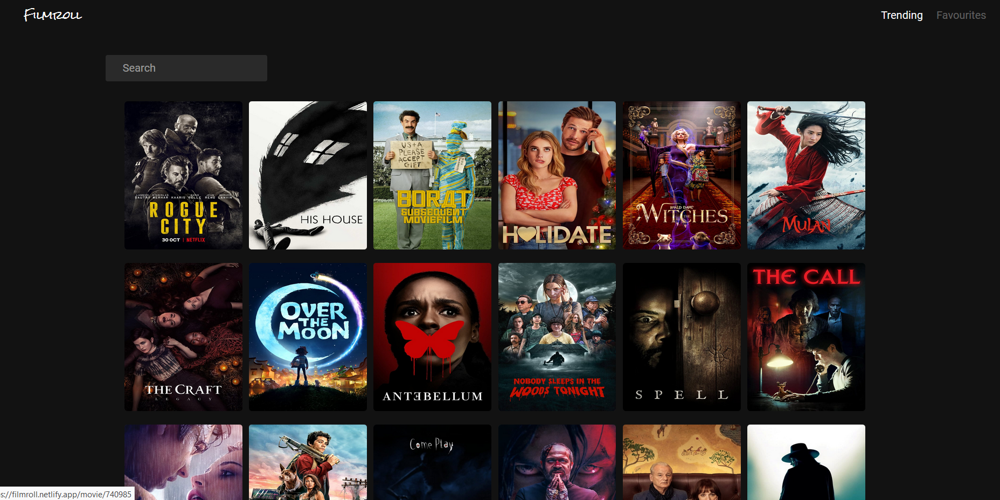

# FilmRoll

## What is it?

A simple app that allows users to search and check out movies. The design is heavily inspired from the Epic Games Store.
Uses the TMDB API for all movie details.

Visit the app here -> https://filmroll.netlify.app/

## Why?

Decided to take on the project as part of teaching myself React. 

## Takeaways

1. Implemented a redux/flux like pattern using Context and Reducer functions.
2. Learnt more about Design to Development by trying to incorporate an established design in Epic Games Store.
3. Local StoraGe manipulation to store favorite movies.

## Future Improvements

1. Add in a user authentication functionality and connect to a database to allow users to take their favorite lists on the go.
2. Add in support for TV Shows and Personalities.
3. Add in Trailers for movies.

## Available Scripts

Before running on your machine, install dependencies using `yarn` or `npm install`

In the project directory, you can run:

### `yarn start`

Runs the app in the development mode. 
Open [http://localhost:3000](http://localhost:3000) to view it in the browser.

The page will reload if you make edits. 
You will also see any lint errors in the console.

### `yarn build`

Builds the app for production to the `build` folder. 
It correctly bundles React in production mode and optimizes the build for the best performance.

The build is minified and the filenames include the hashes. 
Your app is ready to be deployed!

See the section about [deployment](https://facebook.github.io/create-react-app/docs/deployment) for more information.
